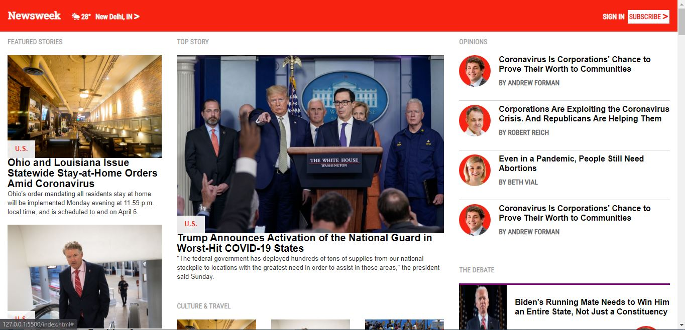

# Using Bootstrap [Solo Project]
Solo Project : This project consists of building a responsive webpage using bootstrap framework.

> The goal is to make a clone of old an old version of the Apple website webpage.

The purpose of this project is to clone the appearance of newsweek.com homepage using bootstrap framework.

## Built With

- HTML,
- CSS,
- Bootstrap
- Stylelint

## Live Demo

[Live Demo Link](https://raw.githack.com/alishabab/newsweek-clone/feature/index.html)

## Getting Started

To get a local copy up and running follow these simple example steps.

### Prerequisites

#### You should have installed git on your local machine and a text editor preferably VS Code.

### Setup

#### Clone the repository into your local machine.

## Authors

👤 **Author**

- Github: [@alishabab](https://github.com/alishabab)
- Twitter: [@shabab_ali](https://twitter.com/shabab_ali)
- Linkedin: [Shabab Ali](https://www.linkedin.com/in/shababali/)

## 🤝 Contributing

Contributions, issues and feature requests are welcome!

Feel free to check the [issues page](issues/).

## Show your support

Give a ⭐️ if you like this project!

## Acknowledgments

- Appreciation to my mentor and stnad up team.

## 📝 License

This project is [MIT](lic.url) licensed.